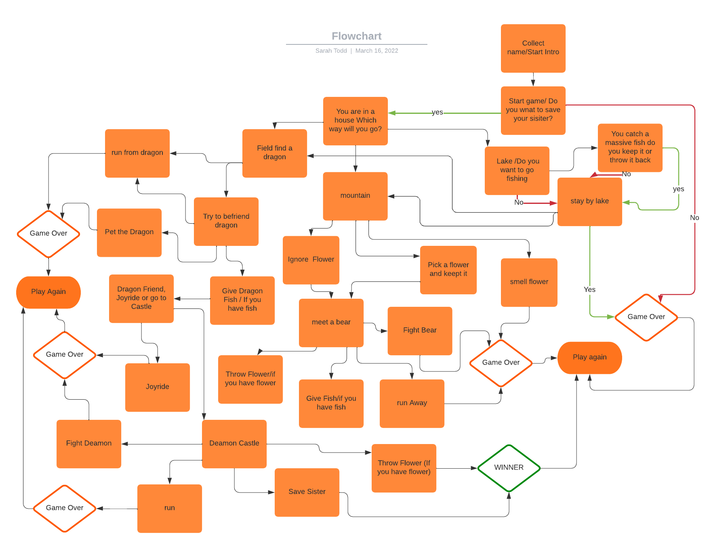
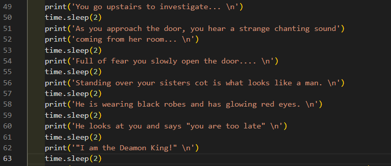
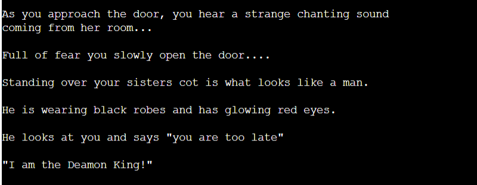
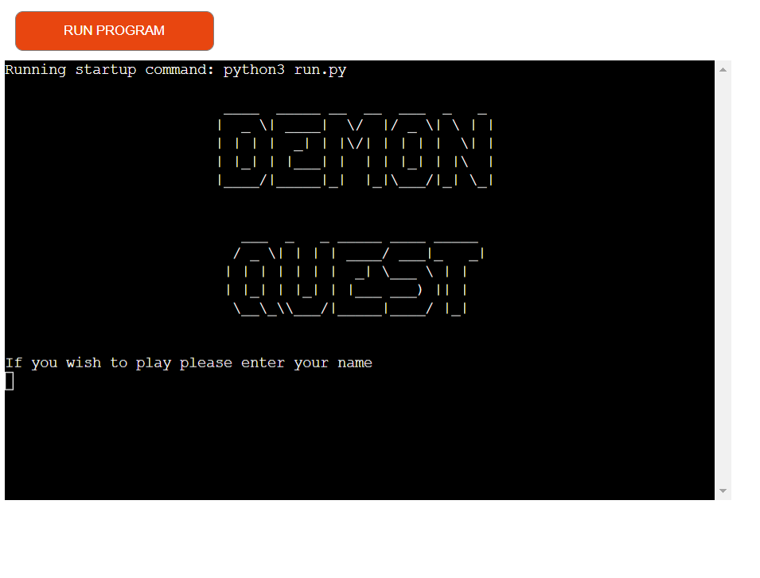
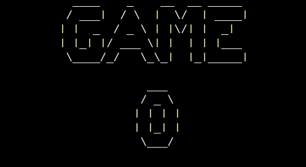
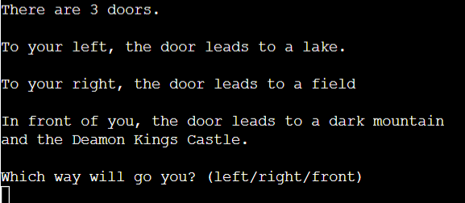
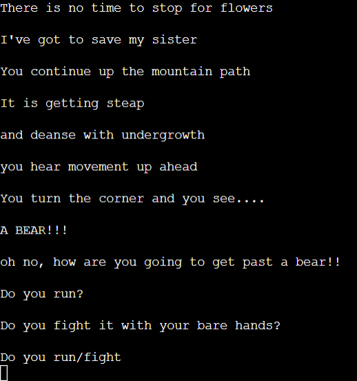

# DEAMON QUEST - TEXT ADVENTURE GAME

gif

[Deamon Quest Live Site](https://pp3-adventure-game.herokuapp.com/)

# Table of Contents

# Objective

Design an interactive text based adventure game, deployed on Heroku using Python.

# About

This is an interactive game, based on old text adventure games such as Collosal Cave Adventure or Mystery Mansion. 

# User Experience (UX)

## Initial Concept

The player of this game navigates their way through the Deamon Realm to find their sister who has been taken by the Deamon King.  They must collect objects and pass different stages of the game to reach the Deamon King's castle and save their sister.

This game is aimed at anyone who can read that likes to play fun games.  There are some interesting ways to die in the game so parental guidance may be required for younger children.  This may be more fun for adults to play who can remember playing text based games as a child.

## Site Goals

The final product will be
- Challenging enough to play
- Written in Python
- Give clear instructions for use and valid inputs
- Handle user input errors appropriately

## User Goals

The site will be based on the following user needs.

- I want the site to be easy to use.
- I want the game to be challenging.
- I want the game to be similar to the ones I played as a child whith a feeling of nostalga.
- I want it to be fun and intersting to play with a route that is not obvious on my first try.

# Logic

I spent some time working out the paths through this game to ensure I had a good idea of the game layout before I started coding.#
I used the flow chart below to record these paths so the game was easy to follow when writing it.   

# Features

- I used the time import to slow down the text using time.slow(2).
This slowed down the text appearing at 2 or 3 second intervals allowing the user to read along with the text appearing like they were being told the sory.  I also put spaces into the lines so it was spaced out.

- I used the pyfiglet import to jazz up the lettering for the game title and the winner and game over functions.

- I also used a loop for the winner and loser functins so the letters would appear individually at the end of the game.  This made a more appealing game ending than just the writing on the page.

- The game has only a couple of correct pathways through.  It is also vital that the player collects the fish from the lake.  It is not always automatic to pick the left turn when playing a game, I felt this made it more intersting to play as it will probably take a good couple of goes before the player makes it to the end.  This keeps the game challenging and interesting as it hopefully takes a few tries to get to the end

- I tried to make the game deaths as interesting as I could.  Being eaten by tiny bugs and baby dragons or exploded by sweet smelling flowers made losing the game funnier and more interesting. 

I used simple input commands so that it is ojvious to the user what words to input.  If the player does input an incorrect word a message appears advising of an incorrect input and reconfirming the correct input words.  This promotes ease of play.

The whole feel of the text game promotes that feeling of nostalga of playing this game on an old computer.

# Features left to impliment

I'm pretty happy with the features this game has at the moment.  The game could be expanded with further branches to go and explore.  For instance when riding the dragon instead of dying at that point it could take you on another bit of adventure needed for the game instead.

# Bugs

There was a bug that showed up some of the game questions at the end of the game after the player inputs that they do not wish to play again.  I fixed this bug by adding an exit function to the end of the loop in the play_again function.

# Testing

I have used the flow chart above to ensure I have played through every branch of the game to ensure there are no errors when playing.

The paths are as follows

- Enter name - correctly takes name and ask again for an input if nothing is entered
- Touch Sphere - 
  - No - Goes to Game Over with no errors
  - Yes - Goes to Deamon Realm with no errors
- Choose a door
  - Left - Goes to lake with no errors
    - Lake 
      - Go fishing - yes - keep fish - yes - stay at lake - yes - Game Over - No Errors
      - Go fishing - yes - keep fish - No - Stay at Lake  - yes - Game Over - No Errors
      - Go fishing - no - Stay at Lake - Yes - Game Over - No Errors
      - keep fish - yes - go to field - see dragon - run from dragon - Game Over - No Errors
      - keep fish - no - go to field - see dragon - befriend dragon - run/pet (correctly doesn't offer fish)
      - keep fish - yes - go to field - see dragon - befriend dragon - run/pet/fish (correctly gives fish option) - joyride - game over - No Errrs
      - keep fish - yes - go to field - see dragon - befriend dragon - run/pet/fish (correctly gives fish option) - castle - run at deamon - Game Over - No Errors
      - keep fish - yes - go to field - see dragon - befriend dragon - run/pet/fish (correctly gives fish option) - castle - run to sister - Winner - No Errors
      - keep fish - no - go to mountain - ignore flower - see bear - run/fight(correctly doesn't offer fish or flower options)- both run and fight go to game over - no errors

      

      -keep fish - yes - go to mountain - ignore flower - see bear - run/fight/fish (correctly doesn't offer flower) 

    - field
      - see dragon - befriend dragon - run from dragon - game over - no errors
      - see dragon- befriend dragon - pet dragon - game over - no errors
    -

       
           

                

bug that asks if you would like to go to the mountain field or stay when they game ends and you say no to continuing.  this needs figuring out.
bug asking questions when the game is finished