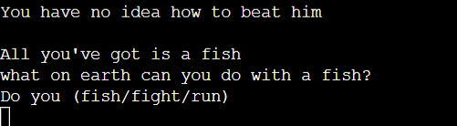

# DEAMON QUEST - TEXT ADVENTURE GAME

gif

[Deamon Quest Live Site](https://pp3-adventure-game.herokuapp.com/)

# Table of Contents

# Objective

Design an interactive text based adventure game, deployed on Heroku using Python.

# About

This is an interactive game, based on old text adventure games such as Collosal Cave Adventure or Mystery Mansion. 

# User Experience (UX)

## Initial Concept

The player of this game navigates their way through the Deamon Realm to find their sister who has been taken by the Deamon King.  They must collect objects and pass different stages of the game to reach the Deamon King's castle and save their sister.

This game is aimed at anyone who can read that likes to play fun games.  There are some interesting ways to die in the game so parental guidance may be required for younger children.  This may be more fun for adults to play who can remember playing text based games as a child.

## Site Goals

The final product will be
- Challenging enough to play
- Written in Python
- Give clear instructions for use and valid inputs
- Handle user input errors appropriately

## User Goals

The site will be based on the following user needs.

- I want the site to be easy to use.
- I want the game to be challenging.
- I want the game to be similar to the ones I played as a child whith a feeling of nostalga.
- I want it to be fun and intersting to play with a route that is not obvious on my first try.

# Logic

I spent some time working out the paths through this game to ensure I had a good idea of the game layout before I started coding.#
I used the flow chart below to record these paths so the game was easy to follow when writing it.   

# Features

- I used the time import to slow down the text using time.slow(2).
This slowed down the text appearing at 2 or 3 second intervals allowing the user to read along with the text appearing like they were being told the sory.  I also put spaces into the lines so it was spaced out.

- I used the pyfiglet import to jazz up the lettering for the game title and the winner and game over functions.

- I also used a loop for the winner and loser functins so the letters would appear individually at the end of the game.  This made a more appealing game ending than just the writing on the page.

I used simple input commands so that it is obvious to the user what words to input.  If the player does input an incorrect word a message appears advising of an incorrect input and reconfirming the correct input words.  This promotes ease of play.

The whole feel of the text game promotes that feeling of nostalga of playing this game on an old computer.

## Game Play

- The player starts the game by entering their name, the game them welcomes them to the game and starts the game intro.

- The story starts with the player babysitting their baby siter on a Saturday evening, when they hear a strange noice from upstairs.  when they get there a Deamon King is taking their sister away.

- The first questions is whether or not to touch an orb.  If they say yes they will continue with the game.  If they answer no they will sarcastically be told how brave they are and the game will be over.

- The story contiues into the Deamon realm.  The player has a choice of 3 doors to go through leading to a lake, a field and a mountain.

- If they go to the field they have an option to go fishing and keep a fish.  The fish is integral to the game.  They are then asked if they want to stay at the lake or move on.  If they stay at the lake they are eaten by millions of tiny sand bugs and the game is over.

- If they move onto the field they will encounter a dragon.  The player must have the fish to befriend the dragon.  If they don't the dragon will either eat them or take them back to its nest and feed them to its dragon babies.

- If the player manages to befriend the dragon then they have the choice to joyride around the realm or go straight to the castle.  If they choose to joyride they will endure an Iccarus style death where the dragon flys too close to the sun and then too close to the sea and they drown and the game is over.

- If they player goes to the castle the meet the Deamon King and can choose to fight him or save their sister.  The correct answer is to run to their sister.  If they fight the Deamon King the dragon ends up burning them both to death and the game is over.

- If the player chooses to go up the mountain they will first encounter some beautiful flowers.  They are give the choice to pick smell or ignore them.  If the smell them they will get a nose full of explosive pollun which causes them to sneese, which in turn causes their head to explode. Game over

- The player next encounters a bear.  If they have picked up the fish from the lake and the flower from the previous stage they will have the choice to either run or fight the bear, or throw the fish or the flower at it.  If they fight the bear it will kill them and the game will be over. If they run they will fall into a patch of the flowers and they will explode.

- If the player uses either the fish or the flower on the bear they will move onto the castle to meet the Deamon King. Here they will be asked if they want to fight or run and either use the fish or the flower depending on what they have with them. If the player has the flower they can throw it at the Deamon causing him to explode.  If they have the fish they can slap him round the face with it causing an allergic reaction and death.  Both of these will win the game.

- The game ending ends up back in the player home waking up on the sofa.  If they won via the mountain path they will check on their sister thinking it is a dream but find the orb still under her bed.

- If they won via the dragon they will wake up and check on their sister, but hear a noice from outside.  The will check the back garden to find the Dragon sitting in their paddling pool.

- The game has only 3 correct pathways through.  It is also vital that the player collects the fish from the lake.  It is not always automatic to pick the left turn when playing a game, I felt this made it more intersting to play as it will probably take a good couple of goes before the player makes it to the end.  This keeps the game challenging and interesting as it hopefully takes a few tries to get to the end

- I tried to make the game deaths as interesting as I could.  Being eaten by tiny bugs and baby dragons or exploded by sweet smelling flowers made losing the game funnier and more interesting. 

- I have left the endings open to further games being made.

-------

# Features left to impliment

I'm pretty happy with the features this game has at the moment.  The game could be expanded with further branches to go and explore.  For instance when riding the dragon, instead of dying at that point it could take you on another bit of adventure needed for the game instead.

# Bugs

There was a bug that showed up some of the game questions at the end of the game after the player inputs that they do not wish to play again.  I fixed this bug by adding an exit function to the end of the loop in the play_again function.

After adding the last option to beat the Deamon King with a fish in the deamon_castle_mountain function the flower option stopped working.  After some consultation on slack we worked out that this bug was caused because I used two if statememts rather than an if elif statement. This bug was easily fixed by alterin that statement.

There is a bug that plays out if the player types fish in the flower/run/fight option in deamon_castle_mountain.  If the player incorrectly inputs fish continues with the fish selection.  I fixed this bug by adding an extra choice variable to the flower and fish options.  choice = 1 for flower and choice = 2 for fish.  This added the extra variable to each option so that entering a variable from the other option would cause an incorrect answer.

# Testing

I have used the flow chart above to ensure I have played through every branch of the game to ensure there are no errors when playing.

The paths are as follows

- Enter name - correctly takes name and ask again for an input if nothing is entered
- Touch Sphere - 
  - No - Goes to Game Over with no errors
  - Yes - Goes to Deamon Realm with no errors
- Choose a door
  - Left - Goes to lake with no errors
    - Lake 
      - Go fishing - yes - keep fish - yes - stay at lake - yes - Game Over - No Errors
      - Go fishing - yes - keep fish - No - Stay at Lake  - yes - Game Over - No Errors
      - Go fishing - no - Stay at Lake - Yes - Game Over - No Errors

      The lake section is all correct so I have written from keep fish yes/no onwards.

      - keep fish - yes - go to field - see dragon - run from dragon - Game Over - No Errors
      - keep fish - no - go to field - see dragon - befriend dragon - run/pet (correctly doesn't offer fish)
      - keep fish - yes - go to field - see dragon - befriend dragon - run/pet/fish (correctly gives fish option) - joyride - game over - No Errrs
      - keep fish - yes - go to field - see dragon - befriend dragon - run/pet/fish (correctly gives fish option) - castle - run at deamon - Game Over - No Errors
      - keep fish - yes - go to field - see dragon - befriend dragon - run/pet/fish (correctly gives fish option) - castle - run to sister - Winner - No Errors
      - keep fish - no - go to mountain - ignore flower - see bear - run/fight(correctly doesn't offer fish or flower options)- both run and fight go to game over - no errors

      

      -keep fish - yes - go to mountain - ignore flower - see bear - run/fight/fish (correctly doesn't offer flower) 
      both fish and flower beat the bear and continue onto the deamon castle correctly.

      

      - keep fish - yes - go to mountain - pick flower - see bear - run/fight/fish/flower - fish - deamon castle - run/fight/flower (corerctly offers flower as fish was used on the bear)- winner - no errors.

      

      I realised at this point in testing that it was possible to get to the castle with a fish but I hadn't put an option in for it.  I then updated the story to add another winning option that involves the fish.

      - keep fish - yes - go to mountain - pick flower - see bear - run/fight/fish/flower - flower - deamon castle - run/fight/fish (correctly offers fish as the flower was used on the bear)- fish - winner no errors.

       

      Further testing after I had added this update showed that the run/fight/flower option was no longer working.  I have written about this in the bug fix section above.

    Field section without going to the lake

    - field - see dragon - befriend dragon - run from dragon - game over - no errors
    - field - see dragon- befriend dragon - pet dragon - game over - no errors

    Mountain section without going to the lake

    - Mountain - see flower - smell flower game over no errors
    - Mountain - see flower - pick flowewr - see bear throw flower at bear - deamon castle - either run or fight deamon ends in game over both with no errors
    - Mountain - see flower - see bear - either run from or fight bear ends in game over with no errors.

    - All the pathways are woking without error and all the options are correctly shown or omitted depending on player secections.

    Next I tested all of the questions with incorrect answers to make sure that there are clear instructions for the correct input words. Every question has an appropriate prompt asking the player to input the correct words when input incorrectly.

    I also tested the questions with optional objects that could be used with the input words that shouldn't have been allowed. eg  fish when the fish had not been collected.  When I did this for the deamon_castle_mountain function I was able to input fish into the option that only gave flower as an input option.  This found a bug that I have written about in the bugs section above and is now fixed.

    I tested the winner and loser functions for each win and loss and they all work appropriately.

    Finally I tested my code in the http://pep8online.com/checkresult 
    This showed no errors

    

# References and Acknowledgements ## Websites used for reference
  https://www.codegrepper.com/code-examples/python/python+slow+print
  https://pythonguides.com/python-exit-command/#:~:text=exit()%20commands.-,Python%20quit()%20function,be%20used%20in%20the%20interpreter.
  https://www.youtube.com/watch?v=O1hEUBsEWnk
  https://github.com/OlgaJ1989/text_adventure

  ## Acknowledgments

  As always my amazing mentor Daisy McGirr and the slack community.
  

  

    heroku
    -

       
           

                

bug that asks if you would like to go to the mountain field or stay when they game ends and you say no to continuing.  this needs figuring out.
bug asking questions when the game is finished