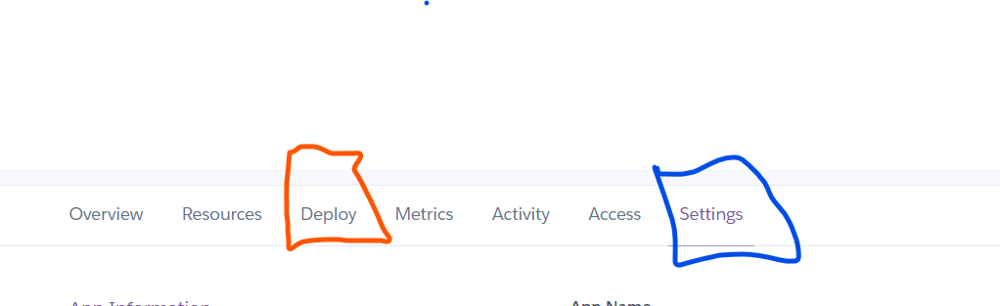

# DEMON QUEST - TEXT ADVENTURE GAME

-----

[Demon Quest Live Site](https://pp3-adventure-game.herokuapp.com/)

# Table of Contents
- [DEMON QUEST - TEXT ADVENTURE GAME](#demon-quest---text-adventure-game)
- [Table of Contents](#table-of-contents)
- [Objective](#objective)
- [About](#about)
- [User Experience (UX)](#user-experience--ux-)
  * [Initial Concept](#initial-concept)
  * [Site Goals](#site-goals)
  * [User Goals](#user-goals)
- [Logic](#logic)
- [Features](#features)
  * [Game Play](#game-play)
- [Features left to implement](#features-left-to-implement)
- [Bugs](#bugs)
- [Testing](#testing)
- [References and Acknowledgements](#references-and-acknowledgements)
  * [Websites used for reference](#websites-used-for-reference)
  * [Acknowledgments](#acknowledgments)
- [Technonogies Used](#technonogies-used)
- [Deployment](#deployment)

<small><i><a href='http://ecotrust-canada.github.io/markdown-toc/'>Table of contents generated with markdown-toc</a></i></small>

# Objective

Design an interactive text-based adventure game, deployed on Heroku using Python.

# About

This is an interactive game, based on old text adventure games such as Colossal Cave Adventure or Mystery Mansion. 

# User Experience (UX)

## Initial Concept

The player of this game navigates their way through the Demon Realm to find their sister who has been taken by the Demon King.  They must collect objects and pass different stages of the game to reach the Demon King's castle and save their sister.

This game is aimed at anyone who can read that likes to play fun games.  There are some interesting ways to die in the game so parental guidance may be required for younger children.  This may be more fun for adults to play who can remember playing text-based games as a child.

## Site Goals

The final product will be
- Challenging enough to play
- Written in Python
- Give clear instructions for use and valid inputs
- Handle user input errors appropriately

## User Goals

The site will be based on the following user needs.

- I want the site to be easy to use.
- I want the game to be challenging.
- I want the game to be similar to the ones I played as a child with a feeling of nostalgia.
- I want it to be fun and interesting to play with a route that is not obvious on my first try.

# Logic

I spent some time working out the paths through this game to ensure I had a good idea of the game layout before I started coding.#
I used the flow chart below to record these paths so the game was easy to follow when writing it.   

# Features

- I used the time import to slow down the text using time.slow(2).
This slowed down the text appearing at 2 or 3 second intervals allowing the user to read along with the text appearing like they were being told the storey.  I also put spaces into the lines so it was spaced out.

- I used the pyfiglet import to jazz up the lettering for the game title and the winner and game over functions.

- I also used the os import a loop for the winner and loser functions so the letters would appear individually at the end of the game.  This made a more appealing game ending than just the writing on the page.

I used simple input commands so that it is obvious to the user what words to input.  If the player does input an incorrect word a message appears advising of an incorrect input and reconfirming the correct input words.  This promotes ease of play.

The whole feel of the text game promotes that feeling of nostalgia of playing this game on an old computer.

## Game Play

- The player starts the game by entering their name, the game then welcomes them to the game and starts the game intro.

- The story starts with the player babysitting their baby sister on a Saturday evening when they hear a strange noise from upstairs.  When they get there a Demon King is taking their sister away.

- The first question is whether or not to touch an orb.  If they say yes they will continue with the game.  If they answer no they will sarcastically be told how brave they are and the game will be over.

- The story continues into the Demon Realm.  The player has a choice of 3 doors to go through leading to a lake, a field or a mountain.

- If they go to the field they have an option to go fishing and keep a fish.  The fish is integral to the game.  They are then asked if they want to stay at the lake or move on.  If they stay at the lake they are eaten by millions of tiny sand bugs and the game is over.

- If they move onto the field they will encounter a dragon.  The player must have the fish to befriend the dragon.  If they don't the dragon will either eat them or take them back to its nest and feed them to its dragon babies.

- If the player manages to befriend the dragon then they have the choice to joyride around the realm or go straight to the castle.  If they choose to joyride they will endure an Icarus style death where the dragon flys too close to the sun and then too close to the sea and they drown and the game is over.

- If the player goes to the castle they meet the Demon King and can choose to fight him or save their sister.  The correct answer is to run to their sister.  If they fight the Demon King the dragon ends up burning them both to death and the game is over.

- If the player chooses to go up the mountain they will first encounter some beautiful flowers.  They are given the choice to pick, smell or ignore them.  If they smell them they will get a nose full of explosive pollen which causes them to sneeze, which in turn causes their head to explode. Game over

- The player next encounters a bear.  If they have picked up the fish from the lake and the flower from the previous stage they will have the choice to either run or fight the bear, throw the fish or the flower at it.  If they fight the bear it will kill them and the game will be over. If they run they will fall into a patch of flowers and they will explode.

- If the player uses either the fish or the flower on the bear they will move onto the castle to meet the Demon King. Here they will be asked if they want to fight or run and possibly either the fish or the flower depending on what they have with them. If the player has the flower they can throw it at the Demon causing him to explode.  If they have the fish they can slap him around the face with it causing an allergic reaction and death.  Both of these will win the game.

- The game ending ends up back in the player's home with them waking up on the sofa.  If they won via the mountain path they will check on their sister thinking it is a dream but find the orb still under her bed.

- If they won via the dragon they will wake up and check on their sister, but hear a noise from outside.  They will check the back garden to find the Dragon sitting in their paddling pool.

- The game has only 3 correct pathways through.  It is also vital that the player collects the fish from the lake.  It is not always automatic to pick the left turn when playing a game, I felt this made it more interesting to play as it will probably take a good couple of goes before the player makes it to the end.  This keeps the game challenging and interesting as it hopefully takes a few tries to get to the end.

- I tried to make the game deaths as interesting as I could.  Being eaten by tiny bugs and baby dragons or exploded by sweet-smelling flowers made losing the game funnier and more interesting. 

- I have left the endings open to further games being made.

-------

# Features left to implement

I'm pretty happy with the features this game has at the moment.  The game could be expanded with further branches to go and explore.  For instance, when riding the dragon, instead of dying at that point it could take you on another bit of adventure needed for the game instead.

# Bugs

There was a bug that showed up some of the game questions at the end of the game after the player inputs that they do not wish to play again.  I fixed this bug by adding an exit function to the end of the loop in the play_again function.

After adding the last option to beat the Demon King with a fish in the demon_castle_mountain function the flower option stopped working.  After some consultation on slack, we worked out that this bug was caused because I used two if statements rather than an if elif statement. This bug was easily fixed by altering that statement.

There is a bug that plays out if the player types fish in the flower/run/fight option in demon_castle_mountain.  If the player incorrectly inputs fish, the game continues with the fish print statements.  I fixed this bug by adding an extra choice variable to the flower and fish options.  choice = 1 for flower and choice = 2 for fish.  This added the extra variable to each option so that entering a variable from the other option would cause an incorrect answer.

# Testing

I have played through every function and every option to ensure there are no errors when playing.
They are as follows

open_image
- Enter name - correctly takes a name and ask again for an input if nothing is entered.

intro
- correctly connects to start_game

start_game
- Asks player to touch the orb
  - 'yes' correctly connects to demon_realm
  - 'no' correctly connects to game_over
  - any other answer correctly receives 'Incorrect answer please type yes or no' message

demon_realm
- Has 3 doors to choose from left, right and front.
  - 'left' correctly connects to lake
  - 'right' correctly connects to field
  - 'front' correctly connects to mountain
  - any other input receives 'incorrect answer you must enter left, right or front' message

lake
 - Has an option to catch a fish.
  - 'yes' correctly connects to lets_fish
  - 'no' correctly connects to stay_at_lake
  - any other input receives 'Incorrect answer please type (yes or no)' message

lets_fish
 - Player catches a fish and has the option to keep the fish. 
  - 'yes' correctly connects to stay_at_lake
  - 'no' correctly connects to stay_at_lake
  - any other answer receives 'Incorrect answer please type (yes or no)' message

stay_at_lake
- Asks player if they want to stay or move on with the game.
  - 'stay' correctly connects to game_over
  - 'mountain' correctly connects to mountain
  - 'field' correctly connects to field
  - any other input receives 'Incorrect answer please type stay mountain or field' message.

field
- Player enters a field and finds a dragon. They can run or befriend the dragon.
  - 'run' correctly connects to run_from_dragon
  - 'befriend' correctly connects to befriend_dragon
  - any other input receives 'Incorrect answer please type (run or befriend)' message

befriend_dragon
- Player has the option to run from the dragon or pet the dragon.  If they have been to the lake they will also have the option to give the fish to the dragon.
  - 'run' correctly connects to run_from_dragon
  - 'pet' correctly connects to game_over
  - 'fish' correctly only appears if you have been to the lake to collect it.  If not only the first to options are given. It correctly connects to new_dragon_friend.
  - If any other input is put in or if fish is entered when it has not been asked for the player receives 'Incorrect answer you must input: {dragon_input}'. message.
 dragon_input correctly states 'Pet the dragon, Run or give the dragon the fish (pet/run/fish)' If the payer has the fish 
or 'Pet the dragon or Run (pet/run)' If they do not.

run_from_dragon
- player runs from the dragon and dies.  This correctly connects to game_over

new_dragon_friend
- the player has befriended the dragon and can choose to joyride or go to the castle.
  - 'joyride' correctly connects to game_over
  - 'castle' correctly connects to demon_castle_dragon
  - Any other input receives 'Incorrect answer please input joyride or castle' message

demon_castle_dragon
- The player meets the Demon King and either run towards the Demon or their sister
  - 'demon' correctly connects to game_over
  - 'sister' correctly connects to winner
  - any other input receives 'Incorrect answer, please input (sister or demon)'message

mountain
- Player takes the mountain path and encounters some flowers that they can pick smell or ignore.
  - 'pick' correctly connects to bear.
  - 'smell' correctly connects to game_over
  - 'ignore' correctly connects to bear

bear
- The player comes across a bear.  If they have kept the fish and picked the flower they can either fight, run, flower, or fish the bear.
  - 'fight and run' both correctly connect to game_over.
  - 'fish correctly only appears if the player has been to the lake and kept the fish.  It also correctly connects to demon_castle_mountain.
 
  - 'flower' correctly only appears if the player has picked the flower. It also correctly connects to demon_castle_mountain
  - Any other input including one fish or flower when the player has not collected them will return :
 Do you {bear_input}
   - bear_input will state (run/fight/flower/fish) if the player has both the flower and the fish.
   - (run/fight/fish) if they only have the fish.
   - (run/fight) if they have neither.
   

It was at this point in testing that I realised that the player could get to the demon castle with a fish and I had not written an outcome for that possibility.  Without thorough testing, I would not have realised this.
I have now written an extra winning ending that contains the fish.

demon_castle_mountain
- The player meets the Demon King and can defeat him with either the fish or the flower if they have it.  Or they can run or fight.
 - 'flower' correctly only appears if the player has picked the flower and not used it on the bear. It correctly connects to winner.
       
 - 'fish' correctly only appears if the player has kept the fish and not used it on the bear. It correctly connects to winner
       .
 - 'run and fight' both correctly connect to game_over.
 - Further testing after I had added the fish update showed that the run/fight/flower option was no longer working.  It was possible to enter fish here and continue with the game.  I have written about this bug in the bugs section above. Once again I wouldn't have found this bug without thorough testing.  Now that it is fixed the incorrect input message is as follows.
   - Incorrect answer please type {end_game}
     - end_game = '(flower/fight/run)'
     - end_game = '(fish/fight/run)'
     - end_game = '(fight/run)'
     - all of these correctly appeared depending on what item I had when testing.

game_over 
- The while loop works correctly. 
- It correctly connects to play_again

winner
- The while loop works correctly 
- It correctly connects to home_from_mountain

home_from_mountain
- describes the ending to the story from the mountain path.
- correctly connects to play_again

play_again
- asks the player if they wish to play again.
 - 'yes' correctly connects to open_image
 - 'no' correctly prints Thank you for playing and correctly exits.
 - Any other input receives 'Incorrect answer please type yes or no' message

Finally, I tested my code in the http://pep8online.com/checkresult 
This showed no errors

# References and Acknowledgements

## Websites used for reference
https://www.codegrepper.com/code-examples/python/python+slow+print
https://pythonguides.com/python-exit-command/#:~:text=exit()%20commands.-,Python%20quit()%20function,be%20used%20in%20the%20interpreter.
https://www.youtube.com/watch?v=O1hEUBsEWnk
https://github.com/OlgaJ1989/text_adventure

## Acknowledgments

As always my amazing mentor Daisy McGirr and the slack community.
  
# Technonogies Used

- http://pep8online.com/
- https://www.lucidchart.com/
- https://id.heroku.com/
- https://www.descript.com/
- http://ecotrust-canada.github.io/markdown-toc/

# Deployment

Deployment through Heroku

1. Go to Heroko.com and sign in.
2. Click New - Create new app

3. Pick a name for your app.  Heroku remembers all app names.  You will see in the picture that this one is very slightly different from my one because I made this walkthrough after I deployed the original project.

4. Go to settings (Circled in blue)

5. Input config vars.  PORT 8000 

6. Input Buildpacks.  It is important that heroku/python is above heroku/nodejs.  You can click and drag them to the correct position if they are input the wrong way round.

7. Go to deployment in the menu (circled in red)

8. You can enable automatic deployment.  This will automatically deploy updates when you push your code to github.
9. Then click Display Branch and a new web page will open with your deployed site.

